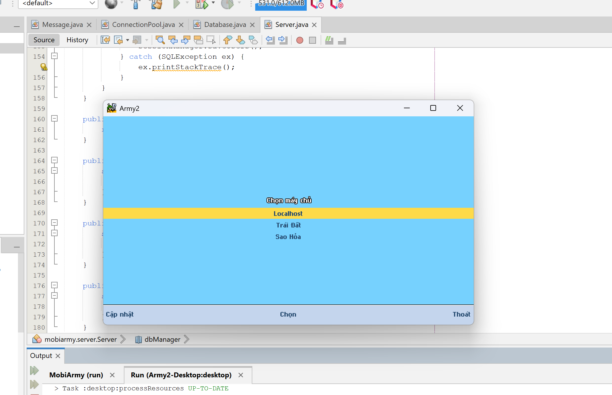
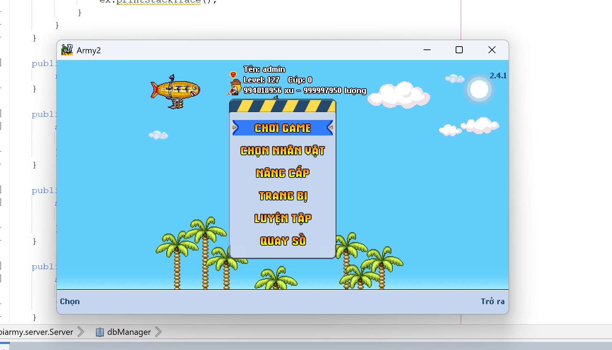
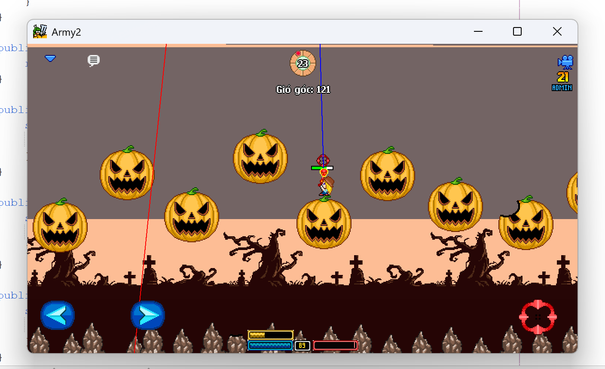
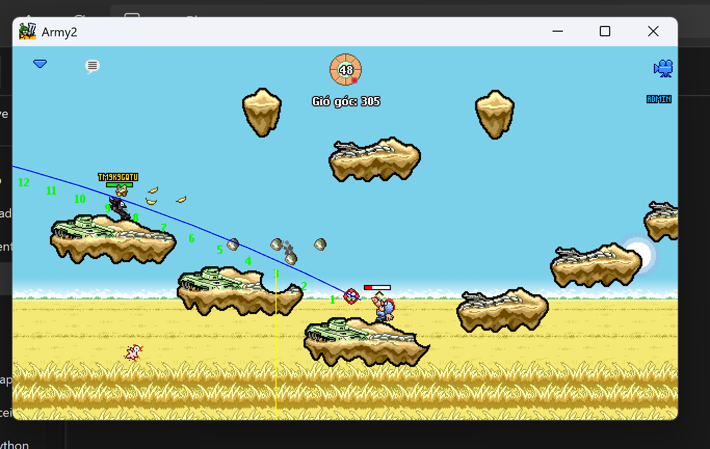

# 📌 Army2 Client - LibGDX

Đây là Project **Army2 Client** được viết lại trên nền tảng **LibGDX**, mô phỏng chính xác 100% cơ chế căn góc của MobiArmy 2.

## 🔹 Giới thiệu
- **Army2 Client** được phát triển lại từ đầu với nền tảng **LibGDX**, giúp trải nghiệm game mượt mà hơn.
- Đây là bản **chính xác 100% về cơ chế căn góc** của MobiArmy 2, một tựa game huyền thoại của **Teamobi**.
- Vì dự án vẫn đang trong quá trình phát triển, bạn có thể gặp một số lỗi trong quá trình chơi. Nếu gặp lỗi, hãy tự tìm hiểu và sửa chữa hoặc đóng góp cho dự án.

### 🛠 Thông tin phát triển
- **Tác giả viết lại:** Văn Tú
- **Dựa trên game gốc:** [MobiArmy 2 của Teamobi](http://teamobi.com/home/game/MobiArmy-2-4.html)

## 📸 Hình ảnh minh họa
Dưới đây là một số hình ảnh về client:






## 💡 Hướng dẫn cài đặt & chạy
1️⃣ **Clone repository:**  
```sh
git clone https://github.com/vantu03/Army2-Desktop.git
```
2️⃣ **Mở dự án trong NetBeans hoặc IntelliJ IDEA.**  
3️⃣ **Chạy file Main.java để bắt đầu game.**  

## 📢 SEO & Đưa Project Đến Nhiều Người Hơn
- **Từ khóa liên quan:** MobiArmy 2, căn góc chuẩn, Teamobi, game bắn súng tọa độ, LibGDX game, client MobiArmy 2.
- **Chia sẻ trên các cộng đồng:** Facebook Group, Reddit, Discord, diễn đàn game.
- **Viết bài trên blog hoặc Medium:** Hướng dẫn cách chạy game, cách chỉnh sửa client.

---

✅ Nếu bạn có bất kỳ góp ý nào, hãy mở **Issues** hoặc tạo **Pull Request** để cải thiện dự án! 🚀

